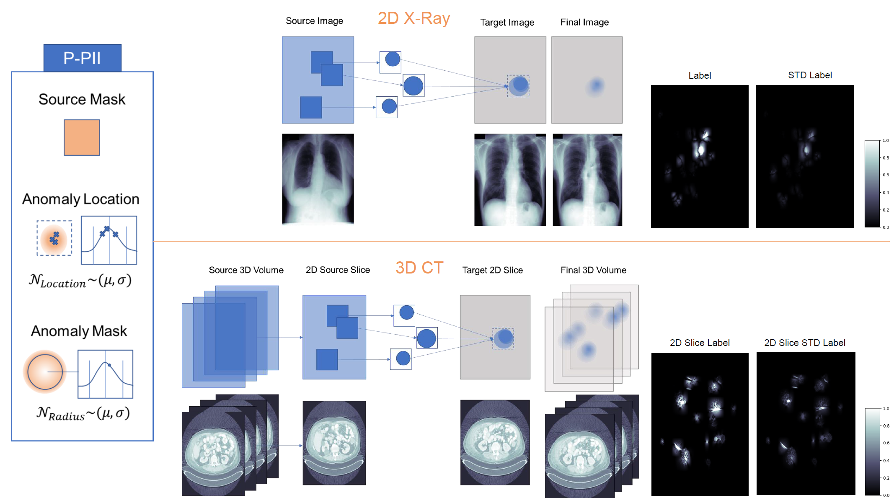

# Probabilistic-PII

Universal anomaly detection still remains a challenging problem in machine learning and medical image analysis. It is possible to learn an expected distribution from a single class of *normative samples*, e.g., through epistemic uncertainty estimates, auto-encoding models, or from synthetic anomalies in a self-supervised way. The performance of self-supervised anomaly detection approaches is still inferior compared to methods that use examples from *known unknown* classes to shape the decision boundary. However, outlier exposure methods often do not identify *unknown unknowns*. Here we discuss an improved self-supervised single-class training strategy that supports the approximation of probabilistic inference with loosen feature locality constraints. We show that up-scaling of gradients with histogram-equalised images is beneficial for recently proposed self-supervision tasks. Our method is integrated into several out-of-distribution (OOD) detection models and we show evidence that our method outperforms the state-of-the-art on various benchmark datasets. [1]

see **MICCAI UNSURE** Publication: [Confidence-Aware and Self-supervised Image Anomaly Localisation](https://link.springer.com/chapter/10.1007/978-3-031-44336-7_18)

## Scheme



Probabilistic PII takes patches from a source image of a given size. A second mask of circular size, drawn from two normal distributions for radius and location inside the source patches, allows aggregated anomalies with smoothly interpolated boundaries. We obtain probabilistic and salient anomalies. [1]

### Code

We provide the *class BatchProvider()* for augmentation and/or self-supervised learning. We blend with [PIE-torch](https://github.com/matt-baugh/pytorch-poisson-image-editing) for faster and more flexible blending. Other necessary libs are [cv2](https://github.com/opencv/opencv-python), [scipy.ndimage](https://github.com/scipy/scipy) and [numpy](https://github.com/numpy/numpy). Feel free to fork our GitHub repo and make the code faster with parallelisation, please do not forget to cite.

## Cite
[1] Müller, J.P., Baugh, M., Tan, J., Dombrowski, M., Kainz, B. (2023). Confidence-Aware and Self-supervised Image Anomaly Localisation. In: Sudre, C.H., Baumgartner, C.F., Dalca, A., Mehta, R., Qin, C., Wells, W.M. (eds) Uncertainty for Safe Utilization of Machine Learning in Medical Imaging. UNSURE 2023. Lecture Notes in Computer Science, vol 14291. Springer, Cham. https://doi.org/10.1007/978-3-031-44336-7_18

```
@inproceedings{p2023confidence,
  title={Confidence-Aware and Self-supervised Image Anomaly Localisation},
  author={M{\"u}ller, Johanna P. and Baugh, Matthew and Tan, Jeremy and Dombrowski, Mischa and Kainz, Bernhard},
  booktitle={International Workshop on Uncertainty for Safe Utilization of Machine Learning in Medical Imaging},
  pages={177--187},
  year={2023},
  organization={Springer}
}
```
